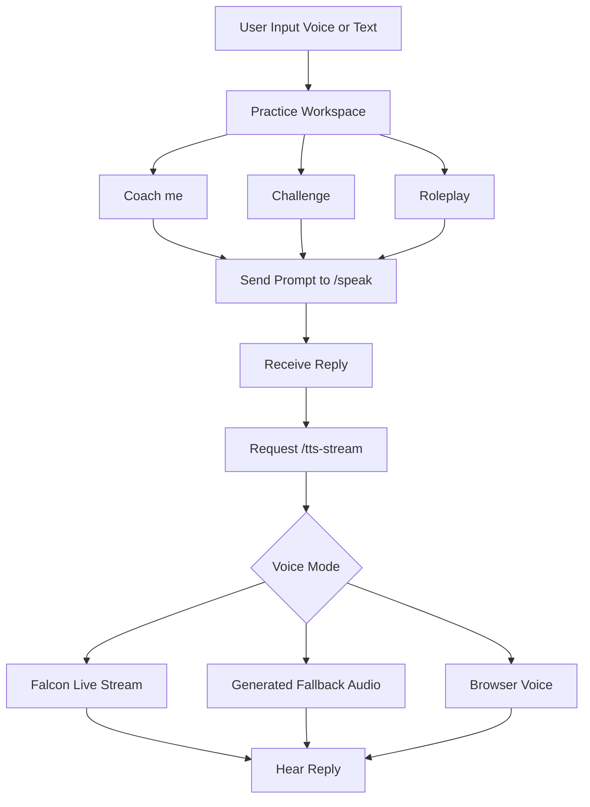
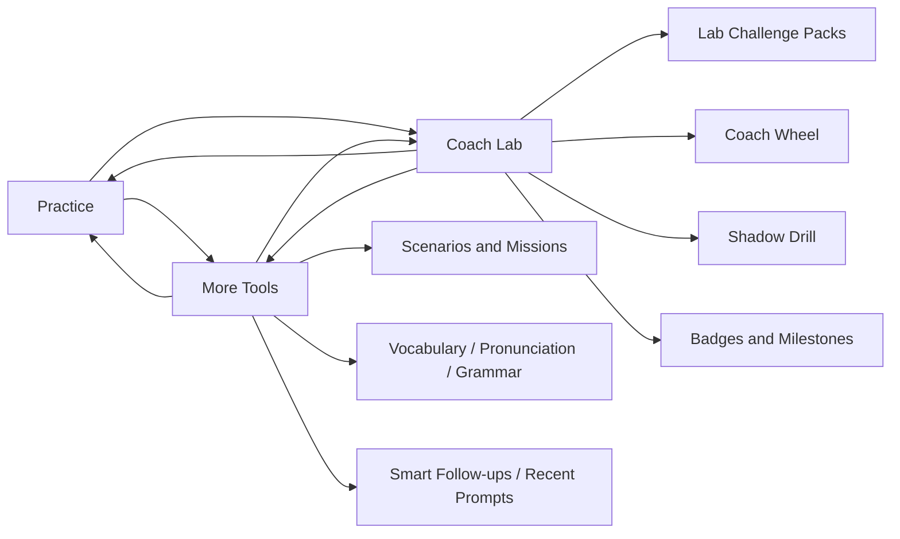

# MoonSpeak-AI Frontend

This folder contains the Vite + React frontend for MoonSpeak-AI.

## Stack

- React 19
- Vite 8
- ESLint 9

## Requirements

- Node.js 20+
- npm

## Setup

```powershell
npm install
```

## Run In Development

```powershell
npm run dev
```

Default local URL:

- `http://localhost:5173`

## API Base URL Behavior

The frontend resolves the backend base URL in this order:

1. `VITE_API_BASE_URL` (if set)
2. If running on `localhost` or `127.0.0.1`, use `/api`
3. Otherwise use `https://moonspeak-ai-backend.onrender.com`

When using `/api` in local development, Vite proxy forwards requests to:

- `http://localhost:5000`

## Environment Variable

Create `.env.local` in this folder if you want to override API target:

```env
VITE_API_BASE_URL=http://localhost:5000
```

## Scripts

```powershell
npm run dev
npm run build
npm run preview
npm run lint
```

## Build And Preview

```powershell
npm run build
npm run preview
```

Build output goes to `dist/`.

## Deploy Notes

- `vite.config.js` uses base path `/MoonSpeak-AI/` for production builds
- If you deploy under a different path, update `vite.config.js`

## Feature Highlights

- Voice-first chat UI for speaking practice
- Multi-language selection
- Speech recognition integration in browser
- AI coaching responses and audio playback
- Local chat history persistence
- Daily streak and progress tracking in local storage

## Frontend Flowchart



## Workspace Pages

- Practice: the main speaking flow with live voice coaching
- More Tools: quick warmups, scenarios, difficulty picks, and language helpers
- Coach Lab: advanced drills, challenge packs, progress tools, and badge tracking

## Coach Actions

Built-in quick actions in the tutor panel:

- Coach me
- Challenge
- Roleplay

## More Tools Includes

- Practice missions (Warm Up, Story Mode, Interview Drill, Confidence Boost)
- Scenario cards and conversation topics
- Difficulty levels
- Vocabulary upgrade tips
- Pronunciation guides
- Grammar tips
- Smart follow-up suggestions
- Recent prompt shortcuts

## Coach Lab Includes

- Lab quick drills
- Session leaderboard (best streak, best XP)
- Progress mode (level, XP, streak)
- Milestone tracker (daily goals, focus time, voice turns, best shadow score)
- Lab challenge packs (Fluency Sprint, Interview Pressure, Story Builder, Debate Booster)
- Coach Wheel random challenge selector
- Shadow Drill with countdown and word-match scoring
- Badge and achievement tracking

## Workspace Navigation Flowchart



## Troubleshooting

If API calls fail in local development:

- Ensure backend is running on `http://localhost:5000`
- Check dev server proxy settings in `vite.config.js`
- Or set `VITE_API_BASE_URL` explicitly in `.env.local`

If speech recognition is inconsistent:

- Use a Chromium-based browser
- Confirm microphone permission is granted
- Verify selected recognition language matches target language

## Important Files

- Main app: `src/App.jsx`
- Vite config: `vite.config.js`
- Global styles: `src/index.css`, `src/App.css`

For full monorepo setup and backend configuration, see the root `README.md`.
