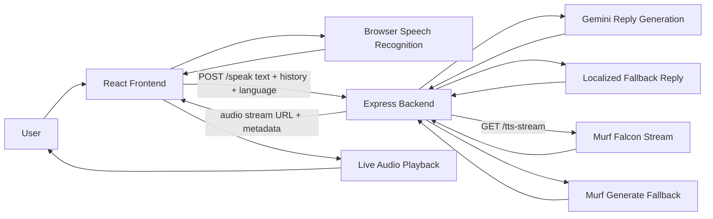

# MoonSpeak AI

MoonSpeak AI is a voice-first English tutor powered by Murf Falcon for low-latency speech playback. The app supports multilingual practice, browser speech recognition, AI replies through Gemini when quota is available, and localized fallback replies when Gemini is unavailable.

**MoonSpeak AI — Voice English Tutor powered by Murf Falcon**

## Hackathon Pitch

MoonSpeak AI is built for learners who need speaking practice, instant feedback, and natural voice delivery instead of static text chat. The product combines browser speech input, multilingual prompting, Gemini-based tutoring, and Murf Falcon voice playback so a learner can speak, get coached, and hear the response back in seconds.

The key demo angle is simple: make spoken language practice feel like a live conversation rather than a form submission. Murf Falcon handles low-latency speech delivery, while the backend keeps the experience resilient with localized fallback replies and audio fallback paths.

## Problem

Many learners struggle with spoken English because most tools are built around typing, grammar drills, or delayed feedback. That creates three gaps:

- speaking practice does not feel conversational
- feedback is often too slow for natural repetition
- multilingual learners need a bridge from their native language into spoken English

## Solution

MoonSpeak AI gives users a voice-first tutoring loop:

- speak into the browser using speech recognition
- send the spoken text and recent conversation context to the backend
- generate a tutor-style reply with Gemini when available
- fall back to localized coaching responses when Gemini quota is unavailable
- stream Murf Falcon audio back for immediate listening practice

## Why It Stands Out

- Low-latency voice response instead of text-only chat
- Murf Falcon streaming as the primary delivery path
- Multilingual practice flow across English and regional languages
- Resilient design with AI and TTS fallbacks instead of hard failures
- Tutor-oriented responses rather than generic assistant answers

## Features

- Voice-first tutoring flow with live playback
- Murf Falcon streaming with generated-audio fallback
- Multiple practice languages, including Hindi, Bengali, Telugu, Tamil, Spanish, French, German, Italian, Portuguese, Japanese, Korean, Chinese, and Arabic
- Browser speech recognition support per selected language
- Local fallback replies when Gemini quota is unavailable
- Conversation history persisted in the browser
- Offline coach mode in the frontend when the backend is unavailable
- Browser voice fallback when streamed backend audio is unavailable
- Practice missions, coach actions, and live conversation stats for demos

## Demo Flow

1. The user selects a practice language and clicks Start Speaking.
2. Browser speech recognition captures the user utterance.
3. The frontend sends `text`, `history`, and `language` to `POST /speak`.
4. The backend generates a coach-style reply using Gemini or a localized fallback.
5. The backend returns a streaming TTS URL.
6. Murf Falcon streams the reply audio back to the frontend.
7. The user hears the answer immediately and continues the conversation.

## Architecture Diagram



## Technical Highlights

- Frontend: React + Vite
- Backend: Node.js + Express
- AI: OpenAI first, Gemini second, localized fallback third
- Voice: Murf Falcon stream first, generated-audio fallback second
- State handling: recent conversation context, persistent local chat history, and resilient offline UI mode
- Multilingual support: configurable language catalog across frontend, AI prompts, speech recognition, and TTS routing

## Judge-Facing Value

- **Usefulness:** solves a real speaking-practice problem for learners who need conversation, not just corrections.
- **Technical depth:** combines browser voice input, AI generation, streamed TTS, and fallback orchestration.
- **Reliability:** still functions when Gemini or a Murf locale is unavailable.
- **Scalability:** language support is configuration-driven through a shared backend catalog.
- **Demo quality:** the product is easy to understand live because the input, reply, and spoken output are immediately visible.

## Project Structure

```text
Backend/
  aiService.js
  languageConfig.js
  murfService.js
  server.js
Frontend/
  lingualive-ui/
```

## Requirements

- Node.js 20+
- A Murf API key
- A Gemini API key

## Environment Setup

Copy the backend example file and fill in your keys:

```powershell
Copy-Item Backend/.env.example Backend/.env
```

Required backend variables:

- `GEMINI_API_KEY`
- `MURF_API_KEY`

Alternative AI provider:

- `OPENAI_API_KEY` (if set, MoonSpeak AI tries OpenAI first)

Optional backend variables:

- `MURF_STREAM_URL`
- `MURF_DEFAULT_VOICE_ID` (default `Natalie`, a multilingual Murf voice)
- `MURF_VOICE_MAP` (JSON map of language id to Murf voice id, for example `{"hi-IN":"Aarav","ja-JP":"Sakura"}`)
- `MURF_VOICE_<LANGUAGE_ID>` overrides, for example `MURF_VOICE_HI_IN=Aarav`
- `OPENAI_MODEL` (default `gpt-4o-mini`)
- `GEMINI_MODEL` (default `gemini-2.0-flash`)

Frontend variable:

- `VITE_API_BASE_URL` (for example `http://localhost:5000` in local dev, or your deployed backend URL in production)

## Zero-Cost AI Setup (Recommended)

For free usage, run Gemini first and keep OpenAI disabled.

Local `Backend/.env` template:

```env
GEMINI_API_KEY=your_real_gemini_key_here
AI_PROVIDER_PRIORITY=gemini-first
GEMINI_MODEL=gemini-2.0-flash
OPENAI_API_KEY=
OPENAI_MODEL=gpt-4o-mini
MURF_API_KEY=your_real_murf_key_here
MURF_STREAM_URL=
MURF_DEFAULT_VOICE_ID=Natalie
MURF_VOICE_MAP={}
```

## Multilingual TTS Notes

- Murf requires a `voiceId` for speech generation.
- MoonSpeak AI now uses a multilingual Murf voice by default instead of an English-only voice id.
- You can assign different Murf voices per supported app language using `MURF_VOICE_MAP` or `MURF_VOICE_<LANGUAGE_ID>` environment variables.
- If a selected voice does not support the requested locale, MoonSpeak AI still falls back safely to the default English voice path.

Render environment variables template:

- `GEMINI_API_KEY` = your real Gemini key
- `AI_PROVIDER_PRIORITY` = `gemini-first`
- `GEMINI_MODEL` = `gemini-2.0-flash`
- `OPENAI_API_KEY` = leave empty (or remove)
- `MURF_API_KEY` = your real Murf key

If free Gemini quota is exhausted, MoonSpeak AI automatically uses local fallback coaching replies.

## Install

Backend:

```powershell
Set-Location Backend
npm install
```

Frontend:

```powershell
Set-Location Frontend/lingualive-ui
npm install
```

## Run

Start the backend:

```powershell
Set-Location Backend
npm run start
```

Start the frontend in a second terminal:

```powershell
Set-Location Frontend/lingualive-ui
npm run dev
```

Frontend default URL:

- `http://localhost:5173`

Backend default URL:

- `http://localhost:5000`

You can also run from the repository root:

```powershell
npm run start
npm run dev
```

- `npm run start` starts the backend from `Backend`
- `npm run dev` starts the frontend from `Frontend/lingualive-ui`

## Build

```powershell
Set-Location Frontend/lingualive-ui
npm run build
```

## GitHub Pages Deployment

This repository includes a GitHub Actions workflow at [.github/workflows/deploy-pages.yml](.github/workflows/deploy-pages.yml) that deploys the frontend to GitHub Pages on every push to `main`.

### One-time GitHub setup

1. Open repository settings and enable GitHub Pages with source set to GitHub Actions.
2. In repository settings, add an Actions variable named `VITE_API_BASE_URL`.
3. Set `VITE_API_BASE_URL` to your deployed backend URL (for example `https://moonspeak-ai-backend.onrender.com`).

After that, pushes to `main` will publish the frontend at:

- `https://athiq2u.github.io/MoonSpeak-AI/`

## Backend Deployment On Render

This repository includes a Render Blueprint file at [render.yaml](render.yaml).

### Option A: Blueprint deploy (recommended)

1. In Render, choose New + and select Blueprint.
2. Connect this GitHub repository.
3. Render will detect [render.yaml](render.yaml) and create the backend service.
4. Set the required environment variables in Render:
  - `OPENAI_API_KEY`
  - `GEMINI_API_KEY`
  - `MURF_API_KEY`
  - optional: `OPENAI_MODEL`
  - optional: `MURF_STREAM_URL`

### Option B: Manual web service

Create a Web Service in Render with these settings:

- Root Directory: `Backend`
- Build Command: `npm install`
- Start Command: `npm run start`
- Health Check Path: `/healthz`

After deploy, copy the Render service URL and set it as the GitHub Actions variable `VITE_API_BASE_URL` so GitHub Pages calls the live backend.

## API

### `GET /`

Basic service status.

### `GET /healthz`

Deployment health check.

### `POST /speak`

Request body:

```json
{
  "text": "Hello, help me practice speaking.",
  "history": [],
  "language": "en-US"
}
```

### `GET /tts-stream`

Query params:

- `text`
- `language`

## Fallback Strategy

- If OpenAI is unavailable, the backend automatically tries Gemini next.
- If Gemini returns quota or auth errors, MoonSpeak AI switches to localized tutor-style fallback replies.
- If Murf Falcon streaming fails, the backend attempts generated audio.
- If a selected locale is unsupported for voice delivery, Murf falls back to the default English voice path.
- If the deployed backend is unavailable, the frontend switches to offline coach mode and can use the device browser voice.

## Notes

- If Gemini returns `429 quota-exceeded`, the app automatically falls back to local tutor replies.
- If OpenAI returns `insufficient_quota`, the app automatically falls back to Gemini or local tutor replies.

## Production Audit (March 2026)

Focused production audit results and fixes:

1. Fixed high-risk Render port issue:
  - backend now binds to `process.env.PORT` with `5000` fallback for local
2. Fixed proxy-aware URL generation risk:
  - backend now trusts proxy headers so HTTPS deployments generate correct stream URLs
3. Added explicit health endpoint:
  - backend now exposes `GET /healthz`
  - Render blueprint health check updated to `/healthz`
4. Simplified frontend availability handling:
  - frontend now relies on live request results and offline coach fallback instead of a manual connection re-check control
5. Residual external risk:
  - if Render URL returns `404`, service is not successfully deployed yet, even if frontend is healthy

## Troubleshooting

### Frontend shows HTML or JSON parse errors

- Confirm `VITE_API_BASE_URL` points to a real backend URL in GitHub Actions variables.
- If the backend is down, the latest frontend build should automatically switch into offline coach mode.

### GitHub Pages works but no real AI responses appear

- Verify your Render backend URL is live.
- Confirm Render has `OPENAI_API_KEY` or `GEMINI_API_KEY` configured.
- If provider quota is exhausted, the app will still work through local fallback replies.

### Backend is running locally but frontend still cannot connect

- Start the backend from `Backend` with `npm run start`.
- Start the frontend from `Frontend/lingualive-ui` with `npm run dev`.
- In local development, the frontend uses `/api` and proxies to `http://localhost:5000`.

### Voice works inconsistently across browsers

- Browser speech recognition is best supported in Chrome-based browsers.
- When backend audio is unavailable, browser voice fallback depends on the voices installed on the device.
- Murf streaming is attempted first. If the selected locale is unavailable, the app falls back to generated audio or default English voice playback.
- `Backend/.env` is intentionally ignored and should never be committed.

## Next Steps

- Add dedicated Murf voices per language instead of locale-only routing
- Add a startup health panel for Gemini and Murf availability
- Add richer interview-mode coaching and scoring
- Add a searchable language selector and user proficiency levels

## Demo Positioning

MoonSpeak AI is positioned as:

**MoonSpeak AI — Voice English Tutor powered by Murf Falcon**
