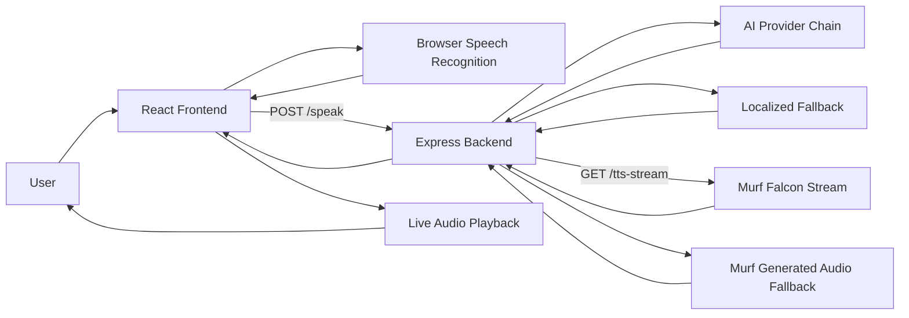

# MoonSpeak AI

## Voice Tutor That Talks Back

MoonSpeak AI is a multilingual, voice-first speaking coach that feels like a live conversation, not a worksheet.

You speak. It responds with coaching. It talks back instantly using Murf Falcon.

Built for Murf AI Voice Hackathon 2026.

## Live Links

| Surface | URL |
|---|---|
| Frontend | https://athiq2u.github.io/MoonSpeak-AI/ |
| Backend API | https://moonspeak-ai-backend.onrender.com |
| Health Check | https://moonspeak-ai-backend.onrender.com/healthz |

## 60-Second Pitch

Most language apps train typing. Real life needs speaking.

MoonSpeak AI closes that gap with a real-time loop:

1. User speaks in their chosen language.
2. Browser speech recognition captures text.
3. Backend generates a tutor-style reply via provider chain.
4. Murf Falcon streams voice output immediately.
5. User repeats, improves, and builds fluency.

## Why This Feels Different

- Voice first, not text first.
- Multilingual by design, not bolted on.
- Online AI with automatic fallback chain.
- Spoken response latency optimized for demo flow.
- Still works in degraded mode (AI/TTS fallbacks).

## Demo Script (Hackathon Friendly)

Use this flow during judging for maximum impact:

1. Open the frontend link and select Tamil or Hindi.
2. Speak one line naturally.
3. Show live tutor reply and source badge.
4. Play Murf voice response.
5. Switch to English and repeat.
6. Open health URL and show provider readiness.

Total time: ~90 seconds.

## "Crazy" Moments To Show

- Language switch mid-demo without page reload.
- Voice response that sounds like a coach, not a robotic assistant.
- AI provider chain behavior without user interruption.
- Speaking practice feels like roleplay, not form filling.

## Core Features

- Voice-first tutoring loop
- Murf Falcon streaming with generated-audio fallback
- AI provider priority modes: `openrouter-first`, `openai-first`, `gemini-first`, plus provider-only modes
- Multilingual support: English, Hindi, Bengali, Telugu, Tamil, Spanish, French, German, Italian, Portuguese, Japanese, Korean, Chinese, Arabic
- Browser speech recognition by selected language
- Localized coach fallback replies when providers fail
- Offline-capable fallback UX when backend is unavailable

## Architecture



## Stack

- Frontend: React + Vite
- Backend: Node.js + Express
- AI: OpenRouter + OpenAI + Gemini (priority configurable)
- Voice: Murf Falcon stream first, generated-audio fallback second

## Quick Start (Local)

### 1. Install

```powershell
Set-Location Backend
npm install
Set-Location ..\Frontend\lingualive-ui
npm install
```

### 2. Configure Backend

```powershell
Copy-Item ..\..\Backend\.env.example ..\..\Backend\.env
```

Recommended `Backend/.env`:

```env
MURF_API_KEY=your_real_murf_key_here
OPENROUTER_API_KEY=your_real_openrouter_key_here
OPENROUTER_MODEL=openai/gpt-4o-mini
OPENROUTER_SITE_URL=https://athiq2u.github.io/MoonSpeak-AI/
OPENROUTER_APP_NAME=MoonSpeak AI
GEMINI_API_KEY=your_real_gemini_key_here
OPENAI_API_KEY=
AI_PROVIDER_PRIORITY=openrouter-first
```

### 3. Run

Backend terminal:

```powershell
Set-Location Backend
npm run start
```

Frontend terminal:

```powershell
Set-Location Frontend/lingualive-ui
npm run dev
```

Defaults:

- Frontend: http://localhost:5173
- Backend: http://localhost:5000

## Deploy

### Frontend (GitHub Pages)

Push to `main` to trigger pages deploy via workflow.

### Backend (Render)

Use `render.yaml` blueprint or create a manual web service with:

- Root Directory: `Backend`
- Build Command: `npm install`
- Start Command: `npm run start`
- Health Path: `/healthz`

Required env vars on Render:

- `MURF_API_KEY`
- At least one AI key: `OPENROUTER_API_KEY` or `OPENAI_API_KEY` or `GEMINI_API_KEY`
- Recommended: `AI_PROVIDER_PRIORITY=openrouter-first`

## API Reference

### `GET /`

Basic status check.

### `GET /healthz`

Provider and service readiness.

### `POST /speak`

```json
{
  "text": "Hello, help me practice speaking.",
  "history": [],
  "language": "en-US"
}
```

### `GET /tts-stream`

Query params: `text`, `language`

## Reliability Model

- Providers are tried in `AI_PROVIDER_PRIORITY` order.
- If one fails, the next provider is used automatically.
- If all fail, localized tutor fallback responses are returned.
- If Murf stream fails, generated-audio path is attempted.

## Production Snapshot (March 2026)

- Frontend live on GitHub Pages
- Backend live on Render
- Health endpoint returns `status: ok`
- Verified `replySource=openrouter` and `isFallback=false` for English and Tamil

## Troubleshooting

No live AI replies:

- Confirm backend URL is reachable.
- Confirm at least one AI key is configured.
- Check `/healthz` provider flags.

Voice inconsistency across browsers:

- Use Chrome-based browsers for best speech recognition.
- Device voice availability impacts browser fallback output.

---

**MoonSpeak AI: Speak. Get coached. Hear it back. Repeat.**