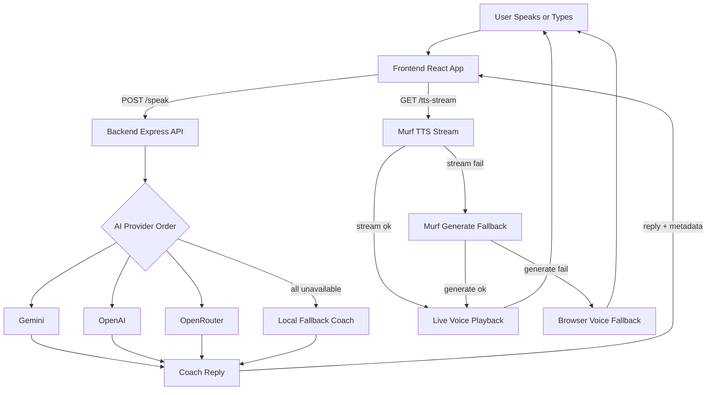
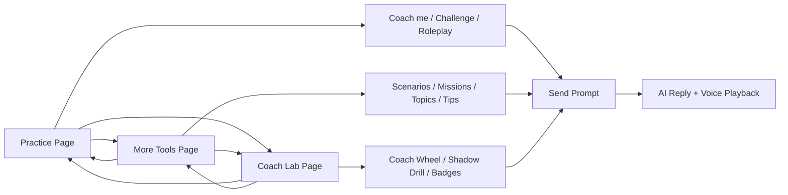

# MoonSpeak-AI

MoonSpeak-AI is a voice-first language practice app for live speaking exercises. It combines a React frontend, an Express backend, browser speech recognition, AI-generated coaching, and Murf voice playback so users can practice conversation in multiple languages.

## Demo Links

- Frontend Demo (GitHub Pages): https://athiq2u.github.io/MoonSpeak-AI/
- Backend API (Render): https://moonspeak-ai-backend.onrender.com
- Backend Health Check: https://moonspeak-ai-backend.onrender.com/healthz

## What It Does

- Lets users practice spoken conversation in multiple languages
- Uses browser speech recognition for voice input
- Sends prompts and recent conversation history to the backend
- Generates coaching responses through configured AI providers
- Streams spoken replies with Murf and falls back when needed
- Keeps local chat history and practice progress in the frontend

## Main Features

- Real-time speaking practice
- Multilingual language selection
- AI provider fallback support
- Text and voice reply playback
- Localized fallback coaching when AI providers are unavailable
- Health endpoint for backend status checks
- Local progress and streak tracking in browser storage
- Multi-workspace UI: Practice, More Tools, and Coach Lab
- Quick coaching actions: Coach me, Challenge, Roleplay
- Scenario and mission flows for interview, storytelling, debate, and fluency drills
- Coach Wheel random challenge picker
- Shadow Drill with countdown and word-level match scoring
- Difficulty levels, conversation topics, vocabulary, pronunciation, and grammar support
- Smart follow-up suggestions and recent prompt recall
- XP levels, daily goals, badges, and session leaderboard

## Tech Stack

- Frontend: React 19, Vite
- Backend: Node.js, Express
- AI providers: OpenRouter, OpenAI, Gemini
- Voice: Murf

## System Flowchart



## Project Structure

```text
.
|-- Backend/
|   |-- aiService.js
|   |-- languageConfig.js
|   |-- murfService.js
|   |-- server.js
|   `-- tests/
|-- Frontend/
|   `-- lingualive-ui/
|       |-- src/
|       |-- public/
|       `-- vite.config.js
|-- docs/
|-- render.yaml
`-- README.md
```

## Requirements

- Node.js 20 or newer
- npm
- A Murf API key
- At least one AI provider key

## Environment Variables

Backend configuration lives in `Backend/.env`.

Create it from the example file:

```powershell
Copy-Item Backend/.env.example Backend/.env
```

Available backend variables:

```env
GEMINI_API_KEY=
OPENAI_API_KEY=
OPENROUTER_API_KEY=
AI_PROVIDER_PRIORITY=gemini-first
OPENAI_MODEL=gpt-4o-mini
GEMINI_MODEL=gemini-2.0-flash
OPENROUTER_MODEL=openai/gpt-4o-mini
OPENROUTER_SITE_URL=
OPENROUTER_APP_NAME=MoonSpeak AI
MURF_API_KEY=
MURF_STREAM_URL=
MURF_DEFAULT_VOICE_ID=Natalie
MURF_VOICE_MAP={}
MURF_REQUEST_TIMEOUT_MS=15000
```

Additional optional voice overrides supported by the backend:

- `MURF_VOICE_<LANGUAGE_ID>` (for example: `MURF_VOICE_EN_US`, `MURF_VOICE_HI_IN`)
- These take priority over `MURF_VOICE_MAP`

Frontend configuration:

- `VITE_API_BASE_URL` points the frontend to the backend API
- If not set:
  - On local hosts (`localhost`/`127.0.0.1`), the frontend uses `/api` and Vite proxy forwards to `http://localhost:5000`
  - On non-local hosts, the frontend defaults to `https://moonspeak-ai-backend.onrender.com`

## Installation

Install backend dependencies:

```powershell
Set-Location Backend
npm install
```

Install frontend dependencies:

```powershell
Set-Location ..\Frontend\lingualive-ui
npm install
```

## Running Locally

Start the backend:

```powershell
Set-Location Backend
npm run start
```

Start the frontend in a separate terminal:

```powershell
Set-Location Frontend\lingualive-ui
npm run dev
```

Local defaults:

- Frontend: `http://localhost:5173`
- Backend: `http://localhost:5000`
- Frontend API route in dev: `/api` (proxied to backend)

## Root Scripts

The root `package.json` provides convenience commands:

```powershell
npm run start
npm run start:backend
npm run dev
npm run dev:frontend
npm run build
```

## Backend Scripts

From `Backend/`:

```powershell
npm run dev
npm run start
npm run check
npm run test
```

## Frontend Scripts

From `Frontend/lingualive-ui/`:

```powershell
npm run dev
npm run build
npm run preview
npm run lint
```

## Tests

Run backend tests:

```powershell
Set-Location Backend
npm run test
```

Current test coverage includes:

- Health and status routes (`GET /`, `GET /healthz`)
- Language config normalization and list integrity

## API Endpoints

### `GET /`

Returns a basic API status response.

### `GET /healthz`

Returns backend health information, including whether Murf and AI providers are configured.

### `POST /speak`

Sends user text and recent history to the backend and returns a generated reply.

Example request body:

```json
{
  "text": "Help me practice a short self introduction.",
  "history": [],
  "language": "en-US"
}
```

Typical response fields:

- `reply`
- `audioFile` / `audioStreamUrl`
- `audioMode`
- `replySource`
- `isFallback`, `fallbackReason`, `fallbackDetails`
- `language`, `languageLabel`
- `assistantNotice`

### `GET /tts-stream`

Streams or returns generated speech audio for a text response.

Query parameters:

- `text`
- `language`
- `mode` (legacy compatibility; `bilingual` maps to Hindi when `language` is not supplied)

## Supported Languages

The frontend currently includes options for:

- English (US)
- English (India)
- Hindi
- Spanish
- French
- German
- Italian
- Portuguese
- Japanese
- Korean
- Chinese
- Arabic
- Bengali
- Tamil
- Telugu

## Practice Experience

The frontend experience is split into three workspace pages:

- Practice: core conversation flow with voice-first input and live coaching replies
- More Tools: focused helpers such as quick-start prompts, scenarios, difficulty picks, vocabulary, pronunciation, grammar, and smart follow-ups
- Coach Lab: advanced drills, milestone tracking, challenge packs, coach wheel, shadow drill, badges, and session controls

Built-in quick actions include:

- Coach me
- Challenge
- Roleplay

## Workspace Flowchart



## Deployment

The backend is set up for Render through `render.yaml`.

Current Render settings in the repo:

- Root directory: `Backend`
- Build command: `npm install`
- Start command: `npm run start`
- Health check path: `/healthz`

The `docs/` folder contains a built frontend output that can be used for static hosting.

Frontend build notes:

- Vite is configured with base path `/MoonSpeak-AI/` during build
- If deployed to a different path, update `Frontend/lingualive-ui/vite.config.js`

## Troubleshooting

If the frontend cannot get live replies:

- Check that the backend is running
- Confirm `VITE_API_BASE_URL` points to the correct backend
- Confirm at least one AI provider key is configured
- Check `GET /healthz` for provider status

If voice playback fails:

- Confirm `MURF_API_KEY` is set
- Check backend logs for TTS errors
- Verify the browser allows audio playback

If speech recognition behaves inconsistently:

- Test in a Chromium-based browser
- Confirm the selected language matches the practice language

## Notes

- The backend limits input text length to 500 characters per request
- The backend trims history before sending it to providers
- When live AI is unavailable, the app can return built-in fallback coaching
