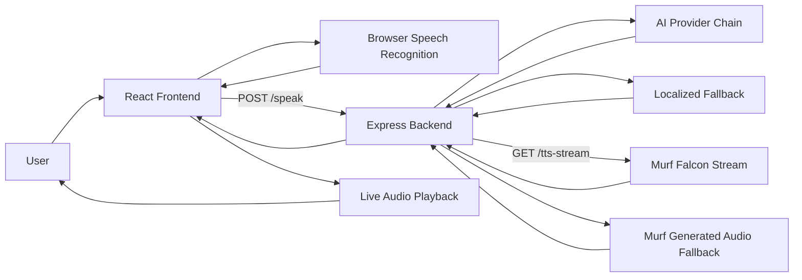

# MoonSpeak AI

**MoonSpeak AI - Voice English Tutor powered by Murf Falcon**

> Murf AI Voice Hackathon 2026 submission

## Live Demo

| | |
|---|---|
| Frontend (GitHub Pages) | https://athiq2u.github.io/MoonSpeak-AI/ |
| Backend API (Render) | https://moonspeak-ai-backend.onrender.com |
| Health check | https://moonspeak-ai-backend.onrender.com/healthz |

## What It Does

MoonSpeak AI gives learners a real-time speaking loop:

1. Speak into the browser.
2. Send text + recent context to the backend.
3. Generate a tutor-style response with configurable AI provider priority.
4. Stream Murf Falcon voice output back instantly.
5. Continue conversation with feedback and practice prompts.

It is built for multilingual learners who want conversation practice, not just grammar correction.

## Why Judges Care

- Real user value: speaking confidence through live conversation
- Technical depth: speech recognition + AI orchestration + TTS streaming
- Reliability: multi-provider AI fallback + TTS fallback paths
- Demo clarity: input, coach reply, and spoken output are all visible and immediate

## Core Features

- Voice-first tutoring flow
- Murf Falcon streaming with generated-audio fallback
- Multilingual support including: English, Hindi, Bengali, Telugu, Tamil, Spanish, French, German, Italian, Portuguese, Japanese, Korean, Chinese, Arabic
- Browser speech recognition per selected language
- Smart fallback to localized coach replies when providers fail
- Conversation history persistence
- Offline coach mode when backend is unavailable

## Architecture



## Tech Stack

- Frontend: React + Vite
- Backend: Node.js + Express
- AI: OpenRouter, OpenAI, Gemini (priority configurable)
- Voice: Murf Falcon stream first, generated-audio fallback second

## Project Structure

```text
Backend/
  aiService.js
  languageConfig.js
  murfService.js
  server.js
Frontend/
  lingualive-ui/
```

## Requirements

- Node.js 20+
- MURF_API_KEY
- At least one AI provider key: OPENROUTER_API_KEY or OPENAI_API_KEY or GEMINI_API_KEY

## Environment Setup

Copy backend env template:

```powershell
Copy-Item Backend/.env.example Backend/.env
```

Recommended backend variables:

```env
MURF_API_KEY=your_real_murf_key_here
OPENROUTER_API_KEY=your_real_openrouter_key_here
OPENROUTER_MODEL=openai/gpt-4o-mini
OPENROUTER_SITE_URL=https://athiq2u.github.io/MoonSpeak-AI/
OPENROUTER_APP_NAME=MoonSpeak AI
GEMINI_API_KEY=your_real_gemini_key_here
OPENAI_API_KEY=
AI_PROVIDER_PRIORITY=openrouter-first
GEMINI_MODEL=gemini-2.0-flash
OPENAI_MODEL=gpt-4o-mini
MURF_STREAM_URL=
MURF_DEFAULT_VOICE_ID=Natalie
MURF_VOICE_MAP={}
```

Frontend variable:

- VITE_API_BASE_URL (example: http://localhost:5000 in local dev, or your deployed backend URL)

## Local Run

Install backend:

```powershell
Set-Location Backend
npm install
```

Install frontend:

```powershell
Set-Location Frontend/lingualive-ui
npm install
```

Run backend:

```powershell
Set-Location Backend
npm run start
```

Run frontend (new terminal):

```powershell
Set-Location Frontend/lingualive-ui
npm run dev
```

Defaults:

- Frontend: http://localhost:5173
- Backend: http://localhost:5000

## Deploy

### GitHub Pages (Frontend)

This repo includes .github/workflows/deploy-pages.yml to deploy on push to main.

One-time setup:

1. Enable GitHub Pages source as GitHub Actions.
2. Add Actions variable VITE_API_BASE_URL.
3. Set VITE_API_BASE_URL to your backend URL.

### Render (Backend)

This repo includes render.yaml for Blueprint deploy.

Required Render env vars:

- MURF_API_KEY
- one or more AI keys: OPENROUTER_API_KEY, OPENAI_API_KEY, GEMINI_API_KEY
- recommended: AI_PROVIDER_PRIORITY=openrouter-first
- optional: OPENROUTER_MODEL, OPENROUTER_SITE_URL, OPENROUTER_APP_NAME, OPENAI_MODEL, GEMINI_MODEL, MURF_STREAM_URL

Manual service settings if not using Blueprint:

- Root Directory: Backend
- Build Command: npm install
- Start Command: npm run start
- Health Check Path: /healthz

## API

### GET /

Basic service status.

### GET /healthz

Deployment health and provider configuration.

### POST /speak

Request body:

```json
{
  "text": "Hello, help me practice speaking.",
  "history": [],
  "language": "en-US"
}
```

### GET /tts-stream

Query params:

- text
- language

## Fallback Behavior

- AI providers are tried in AI_PROVIDER_PRIORITY order.
- If one provider fails, the next provider is attempted.
- If all providers fail, localized tutor-style fallback replies are returned.
- If Murf streaming fails, generated-audio fallback is attempted.
- If backend is unavailable, frontend can switch to offline coach mode.

## Production Status (March 2026)

- Frontend: https://athiq2u.github.io/MoonSpeak-AI/
- Backend: https://moonspeak-ai-backend.onrender.com
- Health: status ok
- Provider mode: openrouter-first
- Verified live: /speak returns replySource=openrouter and isFallback=false for English and Tamil

## Troubleshooting

Frontend shows JSON/HTML errors:

- Verify VITE_API_BASE_URL points to a live backend.

Frontend loads but no live AI response:

- Verify at least one AI key is set in Render.
- Check /healthz provider flags.

Voice inconsistencies across browsers:

- Use Chrome-based browsers for best speech recognition behavior.
- Browser voice fallback depends on installed device voices.

## Positioning

**MoonSpeak AI - Voice English Tutor powered by Murf Falcon**